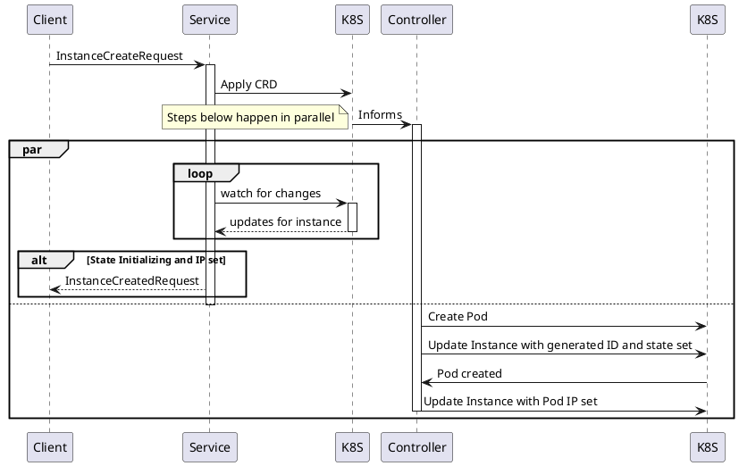

Instances
=========

Step by step sequence when creating an Instance:

As shown above the request will only be successfully returned if the `Pod` corresponding to the `Instance` has been scheduled by Kubernetes and received an IP.

###### tags: `architecture`